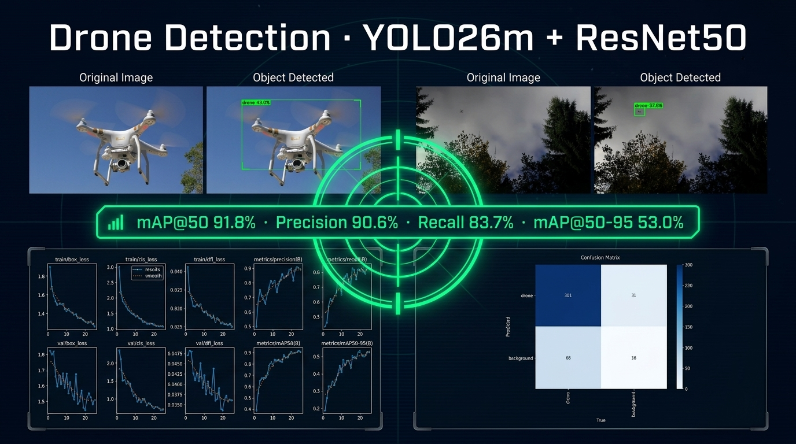
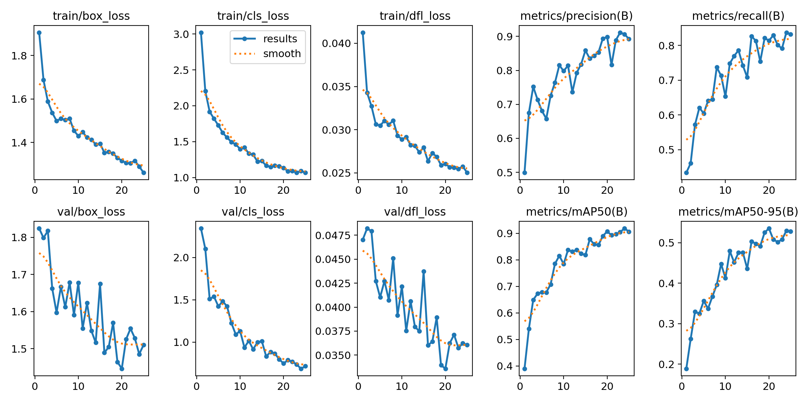
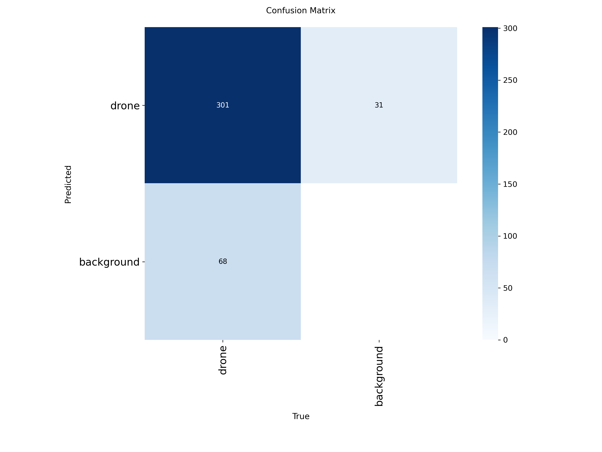

# 🚁 Drone Detection with YOLO26m + ResNet50 Classifier

> Fine-tuned YOLO26m that detects drones in real-world scenes, backed by a ResNet50 binary classifier to correct airplane/drone misclassifications.

<p align="center">
  
</p>

---

## 📊 Results

| Metric | Score |
|--------|-------|
| **mAP@50** | **91.8%** |
| mAP@50-95 | 53.0% |
| Precision | 90.6% |
| Recall | 83.7% |
| Best Epoch | 20 |

---

## 🗂️ Project Structure

```
yolo-drone-detector/
│
├── Drone_Classifier_Results/        # ResNet50 classifier training outputs
│   ├── Confusion Matrix.png
│   ├── Model Accuracy vs Epochs.png
│   ├── Model Loss vs Epochs.png
│   └── Test Set Predicts Samples.png
│
├── Drone_Custom_YOLO_Results/       # YOLO26m fine-tuning outputs
│   ├── confusion_matrix/
│   ├── curves/                      # P, R, F1, PR curves
│   ├── Predicted Outputs/           # Sample detections (Output1-7)
│   ├── training_batches/
│   ├── val_batches/
│   ├── weights/
│   │   ├── best.pt
│   │   └── last.pt
│   └── results.csv / results.png
│
├── Drones_YOLO_with_Classifier_Results/   # YOLO + Classifier combined
│   └── OD1.png → OD7.png
│
├── Visualizations/
│   ├── Augmentation Samples/
│   ├── Objects Predicted on the classifier/
│   └── Original Images Samples from dataset/
│
├── yolo-drone-detector.ipynb        # Main pipeline notebook
└── Drone_Classifier.ipynb           # ResNet50 classifier notebook
```

---

## 🧠 Architecture

The pipeline has two stages:

**Stage 1 - YOLO26m Detection**
- Base model: `yolo26m.pt` (Ultralytics YOLO Vision 2025)
- Fine-tuned on the [YOLO Drone Detection Dataset](https://www.kaggle.com/datasets/muki2003/yolo-drone-detection-dataset)
- Input size: 704×704, AdamW optimizer, lr=1e-4

**Stage 2 - ResNet50 Classifier**
- Triggered when YOLO detects `drone` or `airplane`
- Frozen ResNet50 backbone + single Dense(2, softmax) head
- Trained on drone images (from dataset) + airplane images (Natural Images dataset)
- Overrides YOLO's label and confidence score

---

## 🔧 Augmentation Pipeline

```python
A.HorizontalFlip(p=0.5)
A.OneOf([GaussianBlur, MotionBlur], p=0.3)        # fast-moving drones
A.CoarseDropout(holes=1, size=(80,130), p=0.4)    # occlusion simulation
A.RandomBrightnessContrast(p=0.5)                  # outdoor lighting
A.Rotate(limit=30, p=0.5)
A.Affine(shear=(-10,10), p=0.3)
A.RandomShadow(p=0.2)
A.ImageCompression(quality=(70,100), p=0.2)
A.GaussNoise(var=(5,20), p=0.2)
```

---

## 🚀 Quick Start

```python
from ultralytics import YOLO
from keras.models import load_model

# Load models
yolo_model       = YOLO('Drone_Custom_YOLO_Results/weights/best.pt')
drone_classifier = load_model('drone_classifier_model.keras')

# Run detection
results = yolo_model.predict('your_image.jpg', conf=0.20)
```

---

## 📦 Dependencies

```
ultralytics
keras / tensorflow
albumentations
opencv-python
numpy
matplotlib
scikit-learn
pandas
seaborn
pyyaml
```

---

## 📁 Dataset

[YOLO Drone Detection Dataset - Kaggle](https://www.kaggle.com/datasets/muki2003/yolo-drone-detection-dataset)

- Train: 1,012 images
- Val: 347 images
- Classes: 1 (`drone`)

---

## 📈 Training Curves & Confusion Matrix

<p align="center">
  
</p>

<p align="center">
  
</p>

---

## 🔍 Sample Detections

<p align="center">
  
  
</p>

<p align="center">
  
  
</p>

---

## 📝 License

MIT

